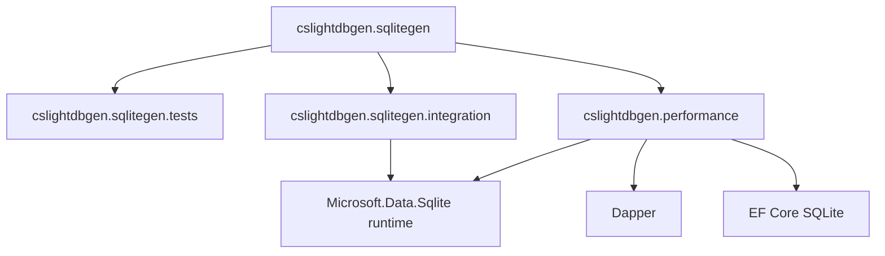

# Modules and Libraries

## Module: `src/cslightdbgen.sqlitegen`

### Responsibility

Implements the Roslyn incremental generator that emits SQLite/FTS data-access code from attributed model declarations.

### Key Files

- `GeneratorAttributes.cs`: attribute names and generated attribute source text.
- `LightSQLiteGenerator.cs`: syntax discovery, semantic analysis, and source emission.
- `cslightdbgen.sqlitegen.csproj`: analyzer packaging + Roslyn dependencies.

### Notable Internal Areas

- Syntax targets: `IsSyntaxTargetClassDec`, `IsSyntaxTargetRecordDec`
- Semantic pipeline: class/record `Execute(...)`
- Table generation path: CRUD/select/filter + extension methods
- FTS generation path: virtual-table creation, populate, select, count
- Type handling: nullable/scalar/enum/JSON collection serialization support

## Module: `tests/cslightdbgen.sqlitegen.tests`

### Responsibility

Unit-level verification of generation contracts and syntax behavior.

### Key Files

- `TestInfrastructure/GeneratorTestHost.cs`
  - Creates in-memory `CSharpCompilation`
  - Executes generator driver
  - Exposes generated source map and diagnostics
- `TestFixtures/FixtureSources.cs`
  - Source snippets for model scenarios (table/index/json/record/inheritance/fts)
- `LightSQLiteGenerator_SyntaxTests.cs`
  - Verifies syntax target detection for class/record paths
- `LightSQLiteGenerator_GenerationTests.cs`
  - Verifies generated source content and compile diagnostics
- `LightSQLiteGenerator_FilterParityTests.cs`
  - Verifies generated filter signatures/options
- `LightSQLiteGenerator_FtsTests.cs`
  - Verifies FTS generation specifics
- `LdgSQLiteUtils_Tests.cs` + `LdgSQLiteUtilsFixture.cs`
  - Tests helper parity for serialization/parsing/html stripping logic

## Module: `tests/cslightdbgen.sqlitegen.integration`

### Responsibility

Integration verification of generated code behavior against in-memory SQLite.

### Key Files

- `IntegrationModels.cs`: real attributed models compiled with analyzer-generated members.
- `LightSQLiteGenerator_IntegrationTests.cs`: end-to-end tests for:
  - table CRUD lifecycle,
  - record model lifecycle,
  - FTS create/populate/search lifecycle.

### Why It Matters

Confirms generated source compiles and executes correctly with actual SQL runtime behavior, beyond string-based generation assertions.

## Module: `tests/cslightdbgen.performance`

### Responsibility

Benchmark harness for comparative performance evaluation.

### Key Files

- `Program.cs`: benchmark switcher entrypoint
- `Benchmarks.cs`: benchmark scenarios and data setup

### Compared Paths

- Generated API (`SqliteGen`)
- Dapper direct SQL
- Dapper `SqlBuilder`
- Entity Framework Core (SQLite provider)

### Scenarios

- single insert
- bulk insert
- single row select
- filtered multi-row select
- unfiltered multi-row select

## Module Relationships

The generator module is the producer. Tests and benchmark projects are consumers that compile with analyzer output and validate functionality/performance.