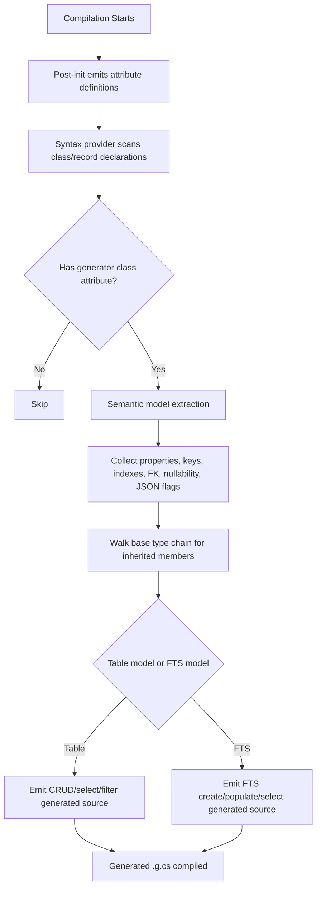
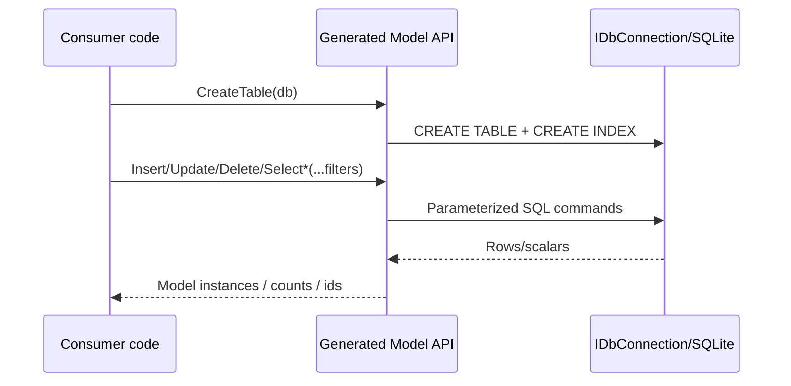
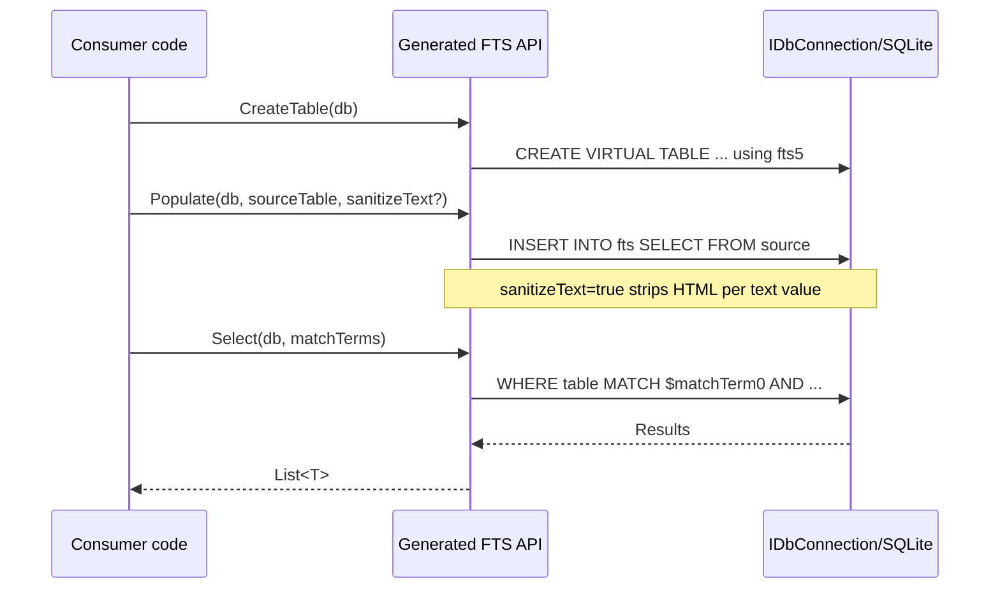
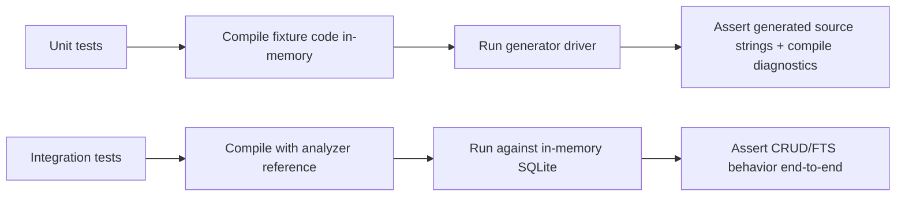
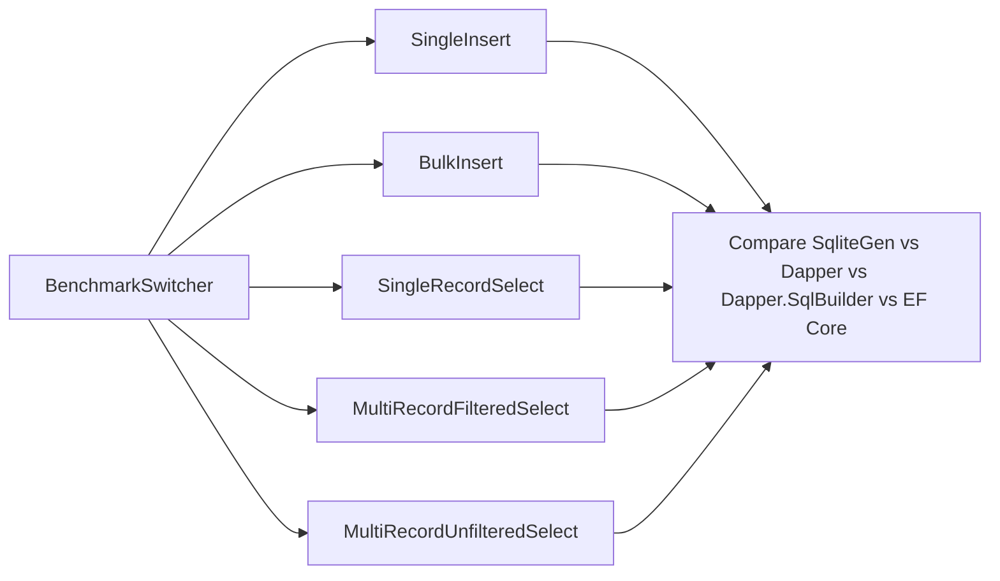

# Process Flows

## 1) Generation Flow (Build-Time)

### Trigger Conditions

A class/record is considered for generation when it has class-level attributes that match:

- `LdgSQLiteTable`
- `LdgSQLiteFtsTable`
- (base marker supported): `LdgSQLiteBaseClass`

## 2) Runtime CRUD Flow (Generated Table Models)

### Key Behavior

- Insert overloads: single value, `List<T>`, `IEnumerable<T>`.
- Select overloads: single, list, enumerable, dictionary, count.
- Filter model generated per property:
  - equality and optional `LIKE` for strings,
  - numeric operator switch (`=`, `!=`, `>`, `>=`, `<`, `<=` and named aliases),
  - nullable tri-state (`PropertyIsNull == true/false/null`),
  - `PropertyValues` list for `IN (...)` on `*Key` style columns.

## 3) Runtime FTS Flow (Generated FTS Models)

## 4) Test Flow

## 5) Benchmark Flow

Benchmark outputs are written under `BenchmarkDotNet.Artifacts/results`.
